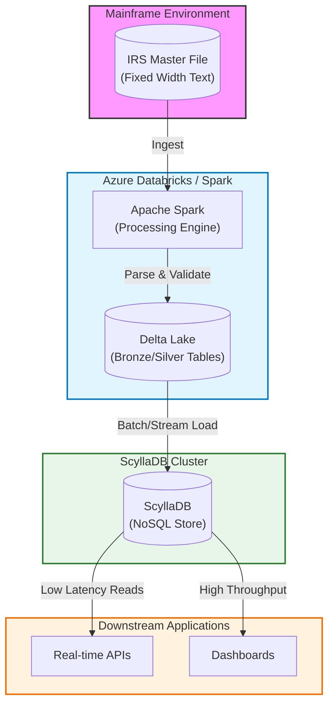

# Data Pipeline Architecture

## Overview
This document outlines the architecture for processing IRS Mainframe data, transforming it within Databricks, and loading it into ScyllaDB for high-performance access.

## Architecture Diagram



## Process Flow

1.  **Ingestion**: Raw fixed-width text files (simulating Mainframe output) are ingested into the Databricks environment.
2.  **Processing (Spark/Delta)**:
    *   **Parsing**: Spark reads the fixed-width files using the defined schema (COBOL copybook structure).
    *   **Transformation**: Data is cleaned, typed (integers, dates), and validated.
    *   **Storage**: Processed data is stored in Delta Lake tables (Parquet format with transaction logs) for reliability and intermediate querying.
3.  **Serving (ScyllaDB)**:
    *   Data is loaded from Delta Lake into ScyllaDB.
    *   ScyllaDB serves as the "hot" data layer, providing millisecond-latency access for APIs and applications.

## Why ScyllaDB?

ScyllaDB is chosen for the serving layer due to several key advantages:

*   **High Performance**: Written in C++ (unlike Cassandra's Java), it utilizes a shared-nothing, shard-per-core architecture that delivers ultra-low latency and high throughput.
*   **Drop-in Compatibility**: It is fully compatible with Apache Cassandra and DynamoDB APIs, allowing you to use existing drivers and tools.
*   **Self-Optimizing**: ScyllaDB automatically tunes itself to the hardware, reducing the operational burden of manual configuration.
*   **Scalability**: It scales linearly with the number of cores and nodes, making it ideal for growing datasets like IRS records.
*   **Real-time Workloads**: Perfect for use cases requiring immediate access to individual taxpayer records (e.g., "Get status for SSN X") which would be too slow directly from a data lake.

## How to Check Data in ScyllaDB

You can interact with ScyllaDB using `cqlsh` (Cassandra Query Language Shell).

### Option 1: Using Docker (Recommended)
Since ScyllaDB is running in a Docker container, you can execute `cqlsh` directly inside it:

```bash
docker exec -it scylla cqlsh
```

Once inside the shell:

```sql
-- Switch to the keyspace
USE irs_data;

-- Describe the table
DESCRIBE master_file;

-- Select some data
SELECT * FROM master_file LIMIT 5;

-- Count rows (Note: COUNT(*) can be slow on huge datasets, but fine for small tests)
SELECT count(*) FROM master_file;
```

### Option 2: Using Python
You can run the verification script we created:

```bash
.venv/bin/python verify_scylla_data.py
```
