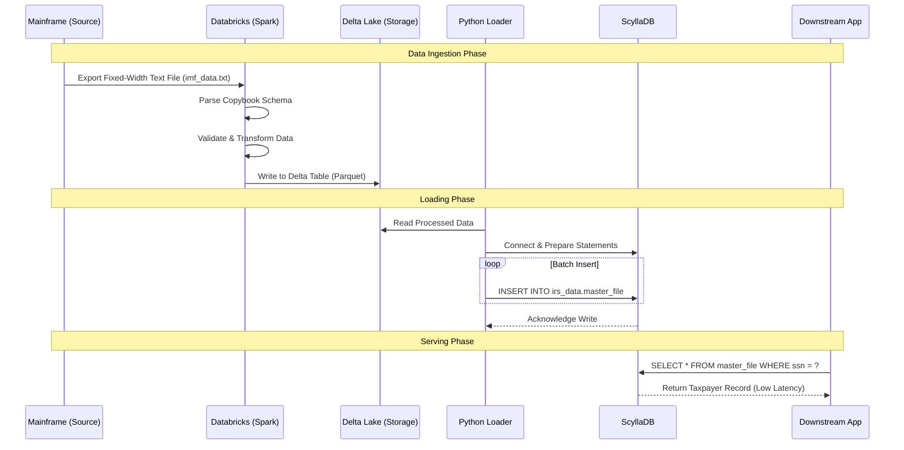

# Data Flow Sequence Diagram

This sequence diagram illustrates the step-by-step flow of data from the Mainframe source to the ScyllaDB serving layer.

```mermaid
sequenceDiagram
    participant MF as Mainframe (Source)
    participant Spark as Databricks (Spark)
    participant Delta as Delta Lake (Storage)
    participant Loader as Python Loader
    participant Scylla as ScyllaDB
    participant App as Downstream App

    Note over MF, App: Data Ingestion Phase
    MF->>Spark: Export Fixed-Width Text File (imf_data.txt)
    Spark->>Spark: Parse Copybook Schema
    Spark->>Spark: Validate & Transform Data
    Spark->>Delta: Write to Delta Table (Parquet)
    
    Note over MF, App: Loading Phase
    Loader->>Delta: Read Processed Data
    Loader->>Scylla: Connect & Prepare Statements
    loop Batch Insert
        Loader->>Scylla: INSERT INTO irs_data.master_file
    end
    Scylla-->>Loader: Acknowledge Write
    
    Note over MF, App: Serving Phase
    App->>Scylla: SELECT * FROM master_file WHERE ssn = ?
    Scylla-->>App: Return Taxpayer Record (Low Latency)
```
